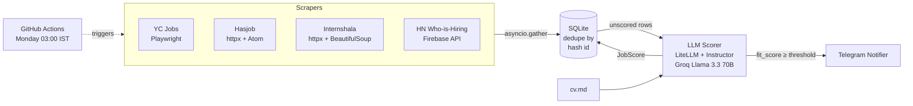

# job-hunter

> A scheduled agent that scrapes four job boards every Monday morning, scores each new posting against my CV with an LLM, and pings me on Telegram for anything worth reading. Runs on GitHub Actions. Costs $0.

**Stack:** Python 3.12 · uv · Playwright · httpx · LiteLLM + Instructor · Groq (Llama 3.3 70B) · SQLite · python-telegram-bot · GitHub Actions

---

## The problem

I'm a student in Bengaluru looking for AI/ML engineering roles at early-stage startups. The good postings are spread across YC's job board, Hacker News's monthly *Who is Hiring?* thread, Hasgeek's community board, and Indian-specific portals like Internshala. Checking four sites every week is boring, and 90% of what each site shows is irrelevant — wrong city, wrong seniority, wrong stack.

I wanted a system that does the boring checking for me and only interrupts my week when something actually matches.

## What it does

Every Monday at 3:00 AM IST, GitHub Actions fires off a workflow that:

1. **Scrapes four sources concurrently** — YC jobs, Hasjob Atom feed, Internshala (3 category URLs), and the HN *Who is Hiring?* thread
2. **Dedupes** new postings against a SQLite database (hash of `url|title` as primary key, so the same job crossposted to multiple boards only gets scored once)
3. **Scores each new job 1–10** with Llama 3.3 70B on Groq, using my CV + a 4-axis rubric (stack overlap, seniority match, company stage, location fit). The LLM returns a Pydantic-validated object via Instructor
4. **Sends a Telegram message** for anything scoring ≥ 7

A typical run processes ~30–60 jobs end-to-end in ~6 minutes. Total cost: **$0.00** (Groq's free tier covers everything).

### Sample output

A Telegram notification for a strong match looks like this:

```
🎯 Score 9/10 — Backend + GenAI Engineer @ Prayaan Capital
📍 Bangalore · hasjob
✅ AI/LLM tooling experience; full-stack shipping; Next.js and Postgres
⚠️ Role requires 2-5 years of experience
🔗 https://hasjob.co/prayaancapital.com/eme5v
```

## Architecture



One-shot path: `Scrapers → SQLite → Scorer → Telegram`. The SQLite layer is the crash-recovery seam — if scoring dies mid-batch, the unscored rows stay in the db and the next run picks up where we left off.

## Sources

| Source | How | Notes |
|---|---|---|
| **YC Jobs** | Playwright headless | `ycombinator.com/jobs` — static list of ~20 latest postings. No server-side location filter, so filter in Python. Playwright because the page needs a bit of JS to fully render. |
| **Hasjob** | httpx + Atom XML | Hasgeek's community board. Atom feed at `/feed` gives ~14 current listings with structured `<location>` tags. Replaced Wellfound after Wellfound started returning 403 to every non-residential IP (Cloudflare Turnstile). |
| **Internshala** | httpx + BeautifulSoup | Large Indian internship portal. Hit three category URLs concurrently (AI / ML / Data Science), dedupe by `internshipid`. Clean static HTML, no anti-bot. |
| **HN Who is Hiring** | Firebase public API | `hacker-news.firebaseio.com/v0` — no auth, no rate limit issues. Fetches all ~400 top-level comments of the latest monthly thread with a semaphore-gated concurrent pull, filters by regex for Bengaluru/India + AI/ML + engineering signals. |

### What I tried and dropped

- **Wellfound / AngelList.** First target. Hard-blocked by Cloudflare Turnstile on every non-residential IP — including stealth-mode Playwright with all the usual tricks (spoofed User-Agent, viewport, timezone, `navigator.webdriver` override). The only public repos that scrape it successfully either (a) pay for residential proxies or (b) automate a real user login with persisted cookies. Both crossed the "personal project" effort budget, so I swapped in Hasjob instead. Full write-up in commit history.
- **LinkedIn.** Same anti-bot story, plus their ToS is explicit. Not worth the risk.

## Tech choices

### LiteLLM + Instructor instead of OpenAI SDK or LangChain

- **LiteLLM** normalises the API across providers — the same `completion()` call works with Groq, OpenAI, Anthropic, Together, xAI. Swapping providers is a one-line config change (`LLM_MODEL=xai/grok-2-latest`). This matters for a portfolio piece because it shows the scoring logic isn't coupled to one vendor.
- **Instructor** wraps LLM tool-calling to guarantee Pydantic-validated output. If the model returns malformed JSON, Instructor reprompts it with the validation error automatically. This is the difference between "I hope the LLM returns valid JSON" and "the function signature returns a `JobScore` or raises". Much easier to reason about.
- **No LangChain, no LlamaIndex.** For a pipeline this small, the framework abstractions cost more than they save. Direct code is more readable and easier to debug.

### Groq Llama 3.3 70B

- Free tier is generous enough for a weekly run (~60 jobs × ~2k tokens = 120k tokens/week, well under Groq's daily caps)
- Fast — most scoring calls return in under a second
- 70B is a sweet spot: smart enough to reliably follow the rubric and emit valid Pydantic, cheap enough to stay free
- The code is model-agnostic; if Groq ever paywalls it, swap to DeepSeek / Gemini Flash / anything else LiteLLM supports

### sqlite-utils for persistence

Two tables: `jobs` (id, source, company, title, ...) and `scores` (job_id FK, fit_score, reasons JSON, ...). The hash-based job ID is the dedupe mechanism — identical across runs for the same posting, so upserts are idempotent. No ORMs, no migrations framework. A `LEFT JOIN` is how the orchestrator finds "jobs that need scoring".

### Pydantic everywhere

`JobPosting` and `JobScore` are Pydantic models, so scraper output → DB → LLM response all share the same validated shape. The `JobScore.fit_score` field uses `Field(ge=1, le=10)`, so an out-of-range score from a confused model is rejected by Pydantic before it ever hits the db.

### Rate limiting via baseline pacing + parse-the-error retry

Groq's free tier caps at 12k tokens/minute. Each scoring call is ~2k tokens. Two layers:

1. **Baseline pace**: sleep 12s between calls. Keeps us comfortably under.
2. **Retry on 429**: parse the exact "try again in Xs" hint Groq includes in its rate-limit error, `asyncio.sleep` that long, retry once. Spec-driven backoff beats exponential-guess.

Combined with persist-as-you-go (each `JobScore` is upserted the moment it comes back), a rate-limit hiccup in the middle of a batch costs nothing — the next run resumes from the first unscored row.

## Setup

### Local dev

```bash
# 1. Clone + install deps
git clone https://github.com/distinguishedape/job-hunter
cd job-hunter
uv sync
uv run python -m playwright install chromium

# 2. Configure
cp .env.example .env       # fill in GROQ_API_KEY, TELEGRAM_*, etc.
cp cv.example.md cv.md     # replace with your actual CV

# 3. Verify Telegram wiring
uv run python -m src.notifier --test   # should ping your Telegram

# 4. Run
uv run python -m src.main
```

### Telegram bot setup

1. Message `@BotFather` on Telegram → `/newbot` → copy the bot token into `.env` as `TELEGRAM_BOT_TOKEN`
2. Message your new bot once (any text)
3. `curl "https://api.telegram.org/bot<TOKEN>/getUpdates"` → find `"chat":{"id":N,...}` → put `N` in `.env` as `TELEGRAM_CHAT_ID`
4. Run `uv run python -m src.notifier --test` — you should get a "Hello from job-hunter" ping

### GitHub Actions (weekly cron)

The workflow at [`.github/workflows/weekly_run.yml`](.github/workflows/weekly_run.yml) runs every Monday 03:00 IST. Before the first scheduled run, add these repo secrets (*Settings → Secrets and variables → Actions*):

| Secret | Value |
|---|---|
| `GROQ_API_KEY` | Groq API key |
| `TELEGRAM_BOT_TOKEN` | BotFather token |
| `TELEGRAM_CHAT_ID` | your numeric chat ID |
| `CV_MD` | full contents of your `cv.md` (pasted as a multi-line secret) |

The CV goes in as a secret rather than committed to the repo — keeps the repo public while keeping the CV private. The workflow materialises `cv.md` from the secret at runtime.

`jobs.db` is persisted across runs via `actions/cache` with run-unique keys + a `restore-keys` prefix fallback, so dedupe state compounds week over week.

## Testing

```bash
uv run pytest
```

Two test suites:

- **`tests/test_scorer.py`** — eval harness with 5 fixture jobs (a strong match, two ambiguous, two definite misses). Uses a mocked LLM client to avoid real API calls, asserts each score is within ±2 of the expected, and prints a TP/FP/TN/FN confusion matrix.
- **`tests/test_notifier.py`** — pure-function tests for MarkdownV2 escaping and message formatting. No network.

## Cost

| Item | Cost |
|---|---|
| Groq API (Llama 3.3 70B, free tier) | $0 |
| Telegram Bot API | $0 |
| GitHub Actions (public repo, 2000 min/mo free tier, run takes ~8 min) | $0 |
| SQLite | $0 |

**Total: $0/week.**

If Groq's free tier ever disappears, the same pipeline runs on DeepSeek V3 (currently the cheapest 70B-class model on the market) for roughly $0.0003 per job scored, or ~$0.02/week at this volume.

## Trade-offs and known limitations

- **HN header parsing is heuristic.** Most posters use `Company | Title | Location | Stack` but some write `Role | Company | ...`. When the split heuristic fails, I keep the full comment text in the `description` field so the LLM has enough context to score correctly — we trade precise list-view labels for scoring accuracy. This is the right call for a personal agent where the LLM sees everything anyway.
- **No retries on scraper failures.** If YC's page structure changes mid-week, that source silently returns 0 jobs for that run and logs a warning — the other three sources still do their work. Good enough for a weekly cadence; a production system would alert on sustained 0-returns.
- **Scoring is sequential, not parallel.** Groq's free tier TPM (12k tokens/minute) makes parallel requests counterproductive — you'd just get rate-limited faster. At ~12s/call the whole batch fits in ~5-6 minutes, which is fine for a weekly run.
- **CV is static.** The CV lives in `cv.md` and is re-read each run. No embeddings, no retrieval — the whole CV fits easily in context. If the CV got much longer I'd chunk it, but at ~1 page this is the simplest thing that works.

## Directory layout

```
src/
  scrapers/
    base.py          # Scraper ABC + location/role keyword filters
    yc.py            # Playwright
    hasjob.py        # Atom feed
    internshala.py   # static HTML
    hn.py            # HN Firebase API
  models.py          # JobPosting, JobScore (Pydantic)
  config.py          # Settings (pydantic-settings, reads .env)
  db.py              # sqlite-utils schema + CRUD
  scorer.py          # LiteLLM + Instructor scoring
  notifier.py        # Telegram send (MarkdownV2)
  main.py            # orchestrator: scrape → dedupe → score → notify
tests/
  test_scorer.py     # eval harness with mocked LLM
  test_notifier.py   # formatting tests
  fixtures/
    sample_jobs.json
.github/workflows/
  weekly_run.yml     # Monday 03:00 IST cron
```
